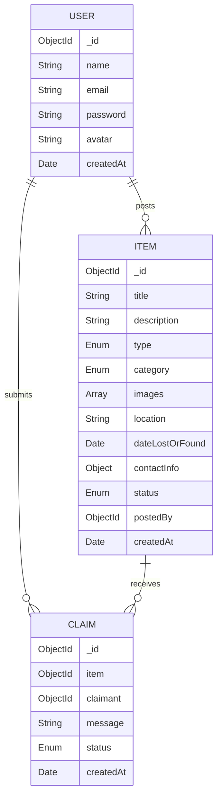

<div align="center">

# 🔍 Lost & Found Portal

**A full-stack campus lost and found management system built with the MERN stack.**

Help your peers reunite with their belongings — report lost items, discover found ones, and manage claims seamlessly.

[](https://nodejs.org/)
[](https://react.dev/)
[](https://www.mongodb.com/atlas)
[](https://expressjs.com/)
[](https://tailwindcss.com/)
[](https://vitejs.dev/)
[](https://cloudinary.com/)
[](LICENSE)

</div>

---

## 📖 Table of Contents

- [About](#-about)
- [Features](#-features)
- [Tech Stack](#-tech-stack)
- [Architecture](#-architecture)
- [Getting Started](#-getting-started)
- [Environment Variables](#-environment-variables)
- [API Reference](#-api-reference)
- [Project Structure](#-project-structure)
- [Deployment](#-deployment)
- [Contributing](#-contributing)
- [License](#-license)

---

## 📌 About

Lost & Found Portal is a full-stack web application designed for college campuses. Students can report items they've lost or found, browse and search through listings, upload photos, and submit ownership claims — all through a clean, modern interface.

Built as a production-ready MERN stack project with best practices including JWT authentication via httpOnly cookies, image hosting on Cloudinary, full-text search with MongoDB indexes, and a responsive UI with Tailwind CSS v4.

---

## ✨ Features

### 🔐 Authentication & Security

- Secure registration and login with encrypted passwords (bcrypt)
- JWT-based session management via **httpOnly cookies** (XSS-safe)
- Protected API routes with middleware-level authorization
- Ownership verification on all write operations

### 📦 Item Management

- Report **lost** or **found** items with rich details
- Upload **multiple images** per item (stored on Cloudinary CDN)
- Full **CRUD** — create, read, update, delete with ownership checks
- Automatic image cleanup on item deletion

### 🔎 Search & Discovery

- **Full-text search** across titles and descriptions (MongoDB text index)
- Filter by **type** (lost/found), **category**, and **sort order**
- Server-side **pagination** with 12 items per page
- URL-synced filters — shareable and bookmarkable search results
- Debounced search input for optimized API calls

### 🤝 Claims System

- Submit claims on items with a descriptive message
- Item owners can **approve** or **reject** claims from their dashboard
- Auto-reject remaining pending claims when one is approved
- Duplicate and self-claim prevention at the database level

### 📊 Dashboard

- At-a-glance statistics: total items, resolved items, active claims
- **My Items** tab — manage your posted items (edit/delete)
- **Claims Received** tab — approve or reject incoming claims
- **Claims Sent** tab — track the status of your submitted claims

### 🎨 User Experience

- Fully **responsive** design — mobile, tablet, and desktop
- **Sticky navigation** with mobile hamburger menu
- Skeleton loading states during data fetches
- Clean, modern UI with Inter font and consistent design language

---

## 🛠 Tech Stack

### Frontend

| Technology          | Purpose                 |
| :------------------ | :---------------------- |
| **React 19**        | UI library              |
| **Vite 6**          | Build tool & dev server |
| **Tailwind CSS v4** | Utility-first styling   |
| **React Router v7** | Client-side routing     |
| **React Hook Form** | Form state management   |
| **Zod**             | Schema validation       |
| **Axios**           | HTTP client             |
| **date-fns**        | Date formatting         |

### Backend

| Technology        | Purpose                     |
| :---------------- | :-------------------------- |
| **Node.js 20+**   | Runtime environment         |
| **Express 5**     | Web framework               |
| **MongoDB Atlas** | Cloud database              |
| **Mongoose**      | ODM / data modeling         |
| **JWT**           | Authentication tokens       |
| **bcryptjs**      | Password hashing            |
| **Cloudinary**    | Image hosting CDN           |
| **Multer**        | Multipart form-data parsing |
| **Helmet**        | HTTP security headers       |
| **Morgan**        | Request logging             |

---

## 🏗 Architecture

```
┌──────────────────┐         ┌──────────────────┐         ┌──────────────────┐
│                  │         │                  │         │                  │
│   React Client   │◄───────►│  Express Server  │◄───────►│  MongoDB Atlas   │
│   (Vite + TW)    │  HTTP   │  (REST API)      │ Mongoose│  (Cloud DB)      │
│                  │         │                  │         │                  │
└──────────────────┘         └────────┬─────────┘         └──────────────────┘
                                      │
                                      │ Upload
                                      ▼
                             ┌──────────────────┐
                             │                  │
                             │   Cloudinary     │
                             │   (Image CDN)    │
                             │                  │
                             └──────────────────┘
```

**Auth Flow:**

```
Client ──POST /register──► Server ──hash password──► MongoDB
                                   ──sign JWT──►
Server ──Set-Cookie: token (httpOnly)──► Client
Client ──GET /me (cookie auto-sent)──► Server ──verify JWT──► return user
```

---

## 🚀 Getting Started

### Prerequisites

| Requirement   | Version       |
| :------------ | :------------ |
| Node.js       | v20 or higher |
| npm           | v10 or higher |
| MongoDB Atlas | Free M0 tier  |
| Cloudinary    | Free account  |

### Installation

**1. Clone the repository**

```bash
git clone https://github.com/YOUR_USERNAME/lost-and-found-portal.git
cd lost-and-found-portal
```

**2. Install server dependencies**

```bash
cd server
npm install
```

**3. Install client dependencies**

```bash
cd ../client
npm install
```

**4. Configure environment variables**

Create `server/.env` — see [Environment Variables](#-environment-variables) section below.

**5. Start development servers**

```bash
# Terminal 1 — Backend (port 5000)
cd server
npm run dev

# Terminal 2 — Frontend (port 5173)
cd client
npm run dev
```

**6. Open the app**

Navigate to **http://localhost:5173** in your browser.

---

## 🔑 Environment Variables

Create a `server/.env` file with the following variables:

```env
# Server
PORT=5000
NODE_ENV=development

# Database
MONGODB_URI=mongodb+srv://<user>:<password>@<cluster>.mongodb.net/lost-and-found?retryWrites=true&w=majority

# Authentication
JWT_SECRET=your-secret-key-minimum-32-characters-long
JWT_EXPIRE=7d

# Cloudinary (Image Uploads)
CLOUDINARY_CLOUD_NAME=your_cloud_name
CLOUDINARY_API_KEY=your_api_key
CLOUDINARY_API_SECRET=your_api_secret

# Client URL (for CORS)
CLIENT_URL=http://localhost:5173
```

<details>
<summary><strong>📋 How to get these values</strong></summary>

#### MongoDB Atlas

1. Create a free account at [mongodb.com/atlas](https://www.mongodb.com/atlas)
2. Create a free M0 cluster
3. Create a database user and whitelist your IP
4. Click **Connect → Drivers → Node.js** and copy the connection string
5. Replace `<password>` and add `/lost-and-found` before the `?`

#### Cloudinary

1. Create a free account at [cloudinary.com](https://cloudinary.com)
2. From the dashboard, copy: **Cloud Name**, **API Key**, **API Secret**

#### JWT Secret

Use any random string, at least 32 characters. Example:

```
openssl rand -hex 32
```

</details>

---

## 📡 API Reference

> Base URL: `http://localhost:5000/api`

### Authentication

| Method | Endpoint         | Description            | Auth |
| :----- | :--------------- | :--------------------- | :--- |
| `POST` | `/auth/register` | Create new account     | ❌   |
| `POST` | `/auth/login`    | Login & receive cookie | ❌   |
| `POST` | `/auth/logout`   | Clear auth cookie      | ✅   |
| `GET`  | `/auth/me`       | Get current user       | ✅   |

### Items

| Method   | Endpoint          | Description                           | Auth |
| :------- | :---------------- | :------------------------------------ | :--- |
| `GET`    | `/items`          | List items (search, filter, paginate) | ❌   |
| `GET`    | `/items/:id`      | Get item details                      | ❌   |
| `POST`   | `/items`          | Create item (multipart/form-data)     | ✅   |
| `PUT`    | `/items/:id`      | Update own item                       | ✅   |
| `DELETE` | `/items/:id`      | Delete own item                       | ✅   |
| `GET`    | `/items/my-items` | Get current user's items              | ✅   |

<details>
<summary><strong>Query Parameters for GET /items</strong></summary>

| Param      | Type   | Description                             | Example                 |
| :--------- | :----- | :-------------------------------------- | :---------------------- |
| `search`   | string | Full-text search on title & description | `?search=iphone`        |
| `type`     | string | Filter by `lost` or `found`             | `?type=lost`            |
| `category` | string | Filter by category                      | `?category=Electronics` |
| `sort`     | string | `oldest` or newest (default)            | `?sort=oldest`          |
| `page`     | number | Page number (default: 1)                | `?page=2`               |
| `limit`    | number | Items per page (default: 12)            | `?limit=6`              |

**Categories:** `Electronics`, `Books`, `Clothing`, `ID Cards`, `Keys`, `Accessories`, `Other`

</details>

### Claims

| Method  | Endpoint              | Description           | Auth |
| :------ | :-------------------- | :-------------------- | :--- |
| `POST`  | `/claims`             | Submit a claim        | ✅   |
| `GET`   | `/claims/received`    | Claims on your items  | ✅   |
| `GET`   | `/claims/sent`        | Your submitted claims | ✅   |
| `PATCH` | `/claims/:id/respond` | Approve or reject     | ✅   |

### Users

| Method | Endpoint         | Description          | Auth |
| :----- | :--------------- | :------------------- | :--- |
| `PUT`  | `/users/profile` | Update profile       | ✅   |
| `GET`  | `/users/stats`   | Dashboard statistics | ✅   |

---

## 📂 Project Structure

```
lost-and-found-portal/
│
├── client/                          # ── Frontend (React + Vite) ──
│   ├── public/
│   ├── src/
│   │   ├── components/
│   │   │   ├── common/
│   │   │   │   └── ProtectedRoute.jsx    # Auth guard for routes
│   │   │   ├── items/
│   │   │   │   └── ItemCard.jsx          # Reusable item card
│   │   │   └── layout/
│   │   │       ├── Navbar.jsx            # Responsive navigation
│   │   │       └── Footer.jsx            # Footer component
│   │   ├── context/
│   │   │   └── AuthContext.jsx           # Global auth state
│   │   ├── pages/
│   │   │   ├── auth/
│   │   │   │   ├── Login.jsx             # Login form
│   │   │   │   └── Register.jsx          # Registration form
│   │   │   ├── Dashboard.jsx             # User dashboard
│   │   │   ├── Home.jsx                  # Landing page
│   │   │   ├── ItemDetail.jsx            # Item detail + claim
│   │   │   ├── Items.jsx                 # Browse + search + filter
│   │   │   ├── NotFound.jsx              # 404 page
│   │   │   └── PostItem.jsx              # Create/edit item form
│   │   ├── utils/
│   │   │   └── api.js                    # Axios instance
│   │   ├── App.jsx                       # Router + route config
│   │   ├── index.css                     # Tailwind imports + theme
│   │   └── main.jsx                      # Entry point
│   ├── index.html
│   ├── vite.config.js                    # Vite + Tailwind + proxy
│   └── package.json
│
├── server/                          # ── Backend (Express + MongoDB) ──
│   ├── config/
│   │   ├── cloudinary.js                 # Cloudinary SDK config
│   │   └── db.js                         # MongoDB connection
│   ├── controllers/
│   │   ├── auth.controller.js            # Register, login, logout, me
│   │   ├── claim.controller.js           # CRUD + approve/reject
│   │   ├── item.controller.js            # CRUD + search + filters
│   │   └── user.controller.js            # Profile + stats
│   ├── middleware/
│   │   ├── auth.js                       # JWT verification
│   │   ├── error.js                      # Global error handler
│   │   └── upload.js                     # Multer config
│   ├── models/
│   │   ├── Claim.js                      # Claim schema
│   │   ├── Item.js                       # Item schema + indexes
│   │   └── User.js                       # User schema + bcrypt
│   ├── routes/
│   │   ├── auth.routes.js
│   │   ├── claim.routes.js
│   │   ├── item.routes.js
│   │   └── user.routes.js
│   ├── utils/
│   │   ├── ApiError.js                   # Custom error class
│   │   └── asyncHandler.js               # Async route wrapper
│   ├── app.js                            # Express app setup
│   ├── server.js                         # Entry point
│   └── package.json
│
├── .gitignore
└── README.md
```

---

## 🌐 Deployment

### Backend → Render (Free)

1. Create an account on [render.com](https://render.com)
2. New → **Web Service** → connect GitHub repo
3. Configure:
   - **Root Directory:** `server`
   - **Build Command:** `npm install`
   - **Start Command:** `node server.js`
4. Add all environment variables from your `.env`
5. Set `CLIENT_URL` to your Vercel frontend URL

### Frontend → Vercel (Free)

1. Create an account on [vercel.com](https://vercel.com)
2. Import your GitHub repository
3. Configure:
   - **Framework:** Vite
   - **Root Directory:** `client`
   - **Build Command:** `npm run build`
   - **Output Directory:** `dist`
4. Add environment variable:
   - `VITE_API_URL` = your Render backend URL + `/api`

---

## 🗄 Database Schema



---

## 🤝 Contributing

Contributions are welcome! Here's how:

1. **Fork** the repository
2. **Create** a feature branch: `git checkout -b feat/amazing-feature`
3. **Commit** your changes: `git commit -m 'feat: add amazing feature'`
4. **Push** to the branch: `git push origin feat/amazing-feature`
5. **Open** a Pull Request

Please follow the existing commit message convention: `type(scope): description`

---

<div align="center">

**Built with ❤️ as a full-stack MERN portfolio project**

</div>
